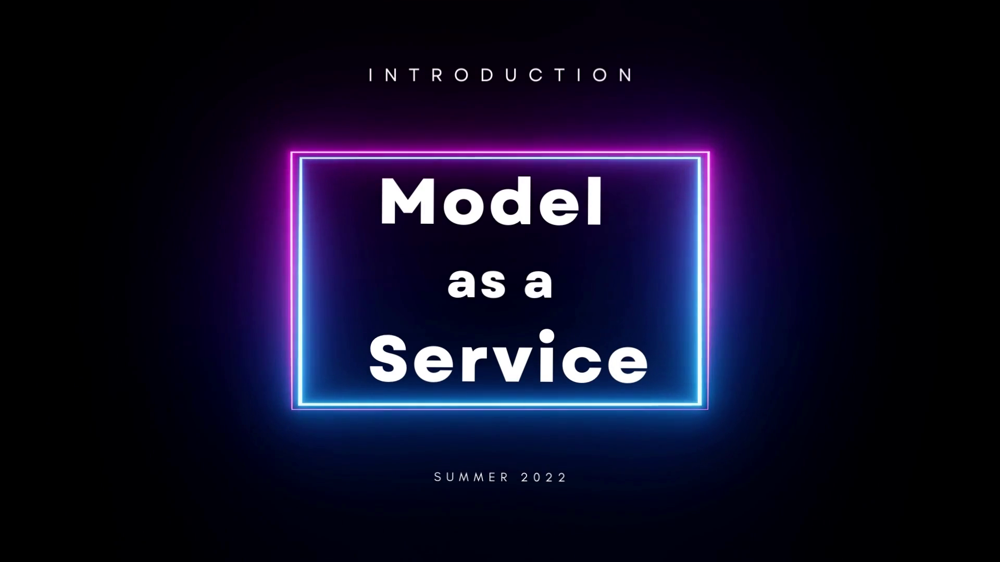

# Assignment_03

> Status ⚠️ : Out of Active Development / Maintenance

## Abstract 📝
Build a Model As a Service application which would classify images of manufactured product as Defective or Not Defective.

## Links 📎
* 🖥 Website - [link](http://maas.anandpiyush.com/)
* 🎬 Video - [link](https://youtu.be/S7mNUrNmOII)

## Video Demo on YouTube 🎬

<a href="https://www.youtube.com/watch?v=S7mNUrNmOII">
  
</a>

---

## Source Code References 💻

1. Branch: **deploy-streamlit** - [link](https://github.com/BigDataIA-Summer2022-Team04/Assignment_03/tree/deploy-streamlit)
    ```text
    ├── Dockerfile
    ├── dataset
    │   └── mini_sample.zip
    ├── main.py
    └── requirements.txt
    ```

2. Branch: **deploy-api** - [link](https://github.com/BigDataIA-Summer2022-Team04/Assignment_03/tree/deploy-api)
    ```text
    ├── Dockerfile
    ├── __init__.py
    ├── custom_functions.py
    ├── database.py
    ├── iam.db
    ├── main.py
    ├── models
    │   ├── augmix
    │   │   ├── keras_metadata.pb
    │   │   ├── saved_model.pb
    │   │   └── variables
    │   │       ├── variables.data-00000-of-00001
    │   │       └── variables.index
    │   ├── cutmix
    │   │   ├── keras_metadata.pb
    │   │   ├── saved_model.pb
    │   │   └── variables
    │   │       ├── variables.data-00000-of-00001
    │   │       └── variables.index
    │   └── mixup
    │       ├── keras_metadata.pb
    │       ├── saved_model.pb
    │       └── variables
    │           ├── variables.data-00000-of-00001
    │           └── variables.index
    ├── models.py
    ├── requirements.txt
    ├── routers
    │   ├── __init__.py
    │   ├── authentication.py
    │   ├── oaut2.py
    │   ├── predict.py
    │   ├── token.py
    │   └── users.py
    └── schemas.py
    ```

3. Branch: **airflow** - [link](https://github.com/BigDataIA-Summer2022-Team04/Assignment_03/tree/airflow)
    ```text
    ├── Dockerfile
    ├── dags
    │   └── sandbox.py
    ├── docker-compose.yaml
    └── requirements.txt
    ```

---
## Undertaking 👮🏻‍♂️

> WE ATTEST THAT WE HAVEN’T USED ANY OTHER STUDENTS’ WORK IN OUR ASSIGNMENT AND ABIDE BY THE POLICIES LISTED IN THE STUDENT HANDBOOK

---